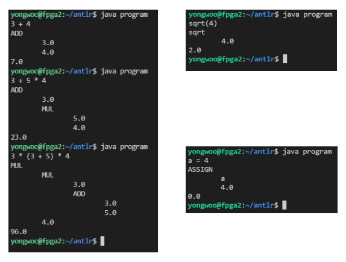
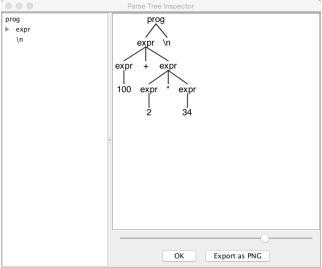

# Assignment 1- ANTLR4


## 문제
ANTLR Visitor class를 통해 AST (Abstract Syntax Tree)를 만드는 Java program 작성


<b>다음의 규칙에 따라 문법을 확장해야 한다.</b>

- 숫자를 변수에 할당
- a = 10;
- 한 변수를 다른 변수에 할당할 수 없다.
- 변수에는 오직 interger와 real value만 할당 가능
- java.lang.Math의 min, max, pow, sort 함수에 대한 Call function 구현 
- min(5,7) = 5
- parse tree를 AST로 변환
- listener 사용불가. visitor만 사용
- Input은 multiple lines가 될 수 있다. 각 line은 세미콜론으로 구분되며, CTRL+D로 프로그램을 종료시킨다.
- 함수의 인자는 오직 number만 입력된다.
- Input으로 음수가 입력될 수 있다.
- Divide by 0과 같은 case는 무시한다.

<b>프로그램은 다음과 같이 작동해야 한다.</b>
- AST를 터미널에 출력
- 프로그램은 ‘+’, ‘*’, ‘-’, ‘/’, ‘=’ 대신 ‘ADD’, ‘MUL’, ‘SUB’, ‘DIV’, ‘ASSIGN’ 을 출력해야 한다.
-  input의 연산값을 출력
- assign expression을 input으로 받으면, 0을 출력



<b> 파일 설명 </b>

- AstNodes.java: AST node를 정의
- BuildAstVisitor.java: ExprBaseVisitor.java를 사용하여 AST를 만듦
- AstCall.java: AST 출력을 구현
- Evaluate.java: 표현식의 연산을 구현
- Program.java: 실행 파일
- AstWalker.java: AST 순회를 구현

<hr>

## 설치
- ANTLR(www.antlr.org) 
▪ https://www.antlr.org/download/antlr-4.9.2-complete.jar

- Installation JRE/JDK & ANTLR

```
$ sudo apt update
$ sudo apt upgrade
$ sudo apt install default-jre
$ sudo apt install default-jdk
$ sudo apt install curl

$ cd /usr/local/lib
$ sudo curl -0 https://www.antlr.org/download/antlr-4.9.2-complete.jar -o 
antlr-4.9.2-complete.jar
$ sudo ln -s antlr-4.9.2-complete.jar antlr-complete.jar
$ vi ~/.bashrc
export CLASSPATH='.:/usr/local/lib/antlr-complete.jar:$CLASSPATH'
alias antlr4='java -jar /usr/local/lib/antlr-complete.jar'
alias grun='java org.antlr.v4.gui.TestRig'

$ source ~/.bashrc
```
<hr>

## 실행
- ANTLR Parser Generator 실행
```
$ antlr4 Expr.g4
$ javac Expr*.java
$ grun Expr prog ±gui
100 + 2*34
^D
```


- 프로그램 실행
```
$ antlr4 -visitor Expr.g4
// 코드 구현
$ javac *.java 
$ java program
```

