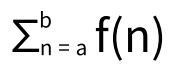

# Assignment 2 - OCaml Practice

## 문제
1. gcd: int -> int -> int function 작성
- 2개의 non-negative integer에 대한 최대공약수를 반환
- 유클리드 호제법 기반

2. prime: int -> bool function 작성
- 주어진 숫자가 소수인지 판별

3. sec_last : int list -> int function 작성
- 주어진 list에서 second last element 반환

4. merge: int list -> int list -> int list function 작성
- 두 integer list를 내림차순으로 정렬 후 합쳐서 반환

5. range: int -> int -> int list function 작성
- "range lower upper" 형태
- [lower ... upper] 범위의 list를 반환
- lower가 upper보다 크다면, 빈 list 반환

6. sigma: int * int * (int -> int) -> int function 작성
- sigma(a, b, f)는 다음의 값을 반환

7. fold3: ('a -> 'b -> 'c -> 'd -> 'a) -> 'a -> 'b list -> 'c list -> 'd list -> 'a function 작성

- fold3 f a [b1;b2;...;bn] [c1;c2;...;cn] [d1;d2;...;dn] = f(...(f (f a b1 c1 d1) b2 c2 d2) ...) bn cn dn
- 모든 인자 list의 길이는 같다.