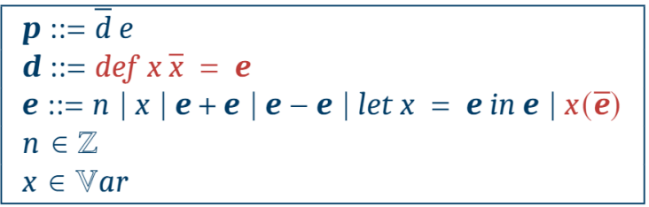
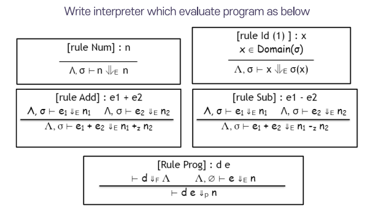
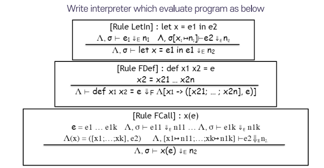
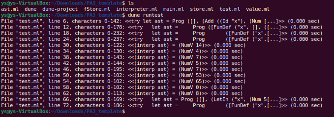

# Assignment 3 - OCaml F1VAE Interpreter

## 문제
- OCaml로 interpreter 구현
- Add, Sub, Id, FunDef, Num, Prog, LetIn, Call semantics 구현

<b> 규칙 </b>

- interpreter.ml의 3개 함수 작성
- interpreter.ml 외 다른 파일 수정불가
- Error handling 필요 (test.ml에서 확인가능)

<b> 파일 설명 </b>

- ast.ml: F1VAE 언어에 대한 AST
- dune, dune-project, main.ml: 빌드 파일
- fStore.ml: 함수에 대한 추상 메모리
- store.ml: identifier에 대한 추상 메모리
- test.ml: 테스트 케이스
- value.ml: value
<hr>

## Syntax of F1VAE



## Semantics of F1VAE




<hr>

## 설치
- Opam >= 2.0
- OCaml >= 4.12.0
- Dune >= 2.0

### 필요 라이브러리
- opam install core (OCaml standard library)
- opam install ppx_compare (Preprocessor of OCaml)
- opam install menhir (OCaml parser generator)

<hr>

## 실행

```
$ dune runtest
```



- 모든 테스트 케이스를 통과했을 경우 다음과 같이 출력된다.